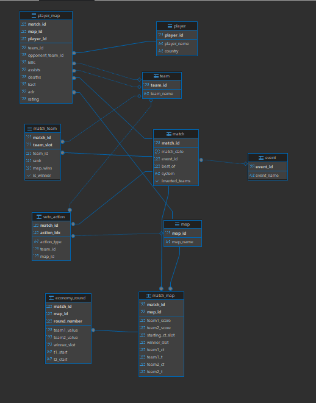
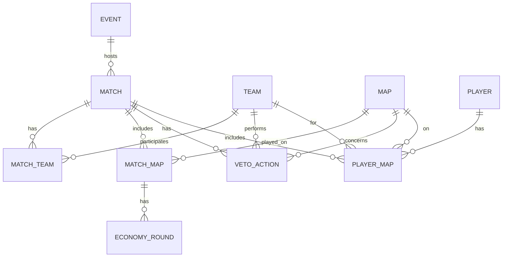
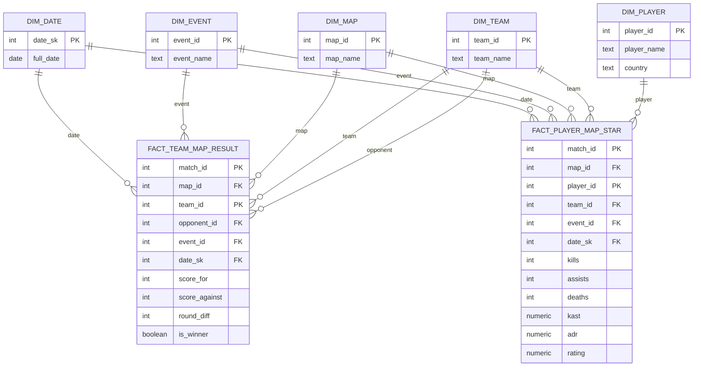
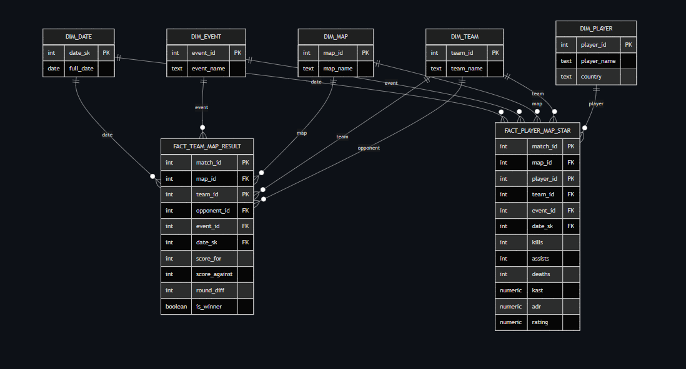
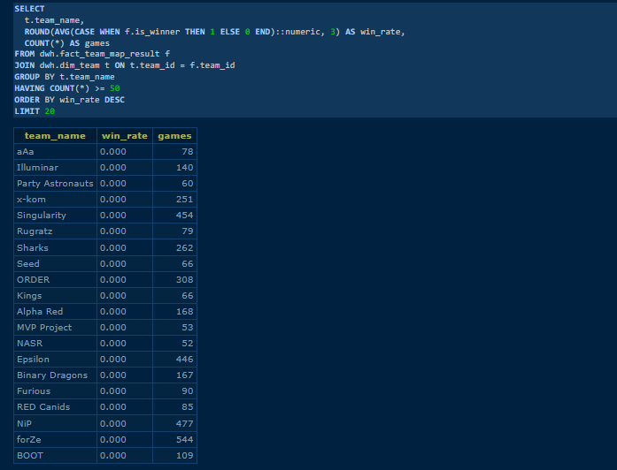
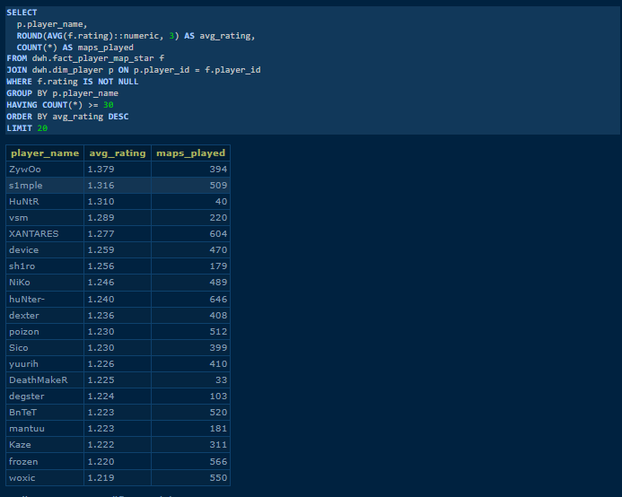
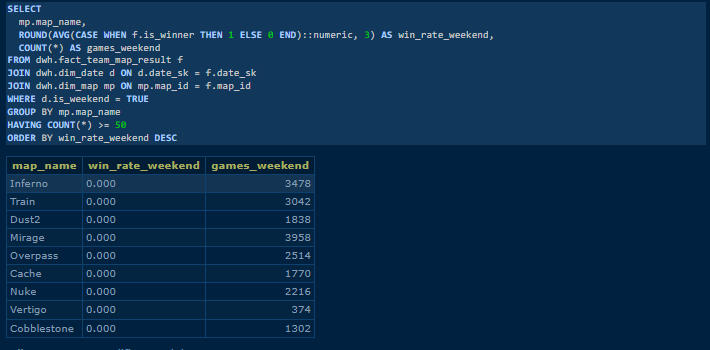

# TP – Pipeline Data (CS:GO Pro Matches)
**CSV → PostgreSQL (staging) → Modèle relationnel (rel) via Docker Compose**
> Inclut **l’Atelier 2** : un modèle **dimensionnel (schéma `dwh`)** orienté analyse/BI.
---

## Sommaire
- [1. Objectif](#1-objectif)
- [2. Dataset](#2-dataset)
- [3. Architecture Docker](#3-architecture-docker)
- [4. Structure du projet](#4-structure-du-projet)
- [5. Mise en place et exécution](#5-mise-en-place-et-exécution)
  - [5.1 Prérequis](#51-prérequis)
  - [5.2 Configuration (.env)](#52-configuration-env)
  - [5.3 Démarrage des services](#53-démarrage-des-services)
  - [5.4 Étape 2 – Import CSV vers staging](#54-étape-2--import-csv-vers-staging)
  - [5.5 Étape 3 – Transformation vers rel](#55-étape-3--transformation-vers-rel)
- [6. Modèle relationnel (schéma rel)](#6-modèle-relationnel-schéma-rel)
  - [6.1 Entités](#61-entités)
  - [6.2 Tables d’association](#62-tables-dassociation)
  - [6.3 ERD (Mermaid)](#63-erd-mermaid)
- [7. Validations et preuves](#7-validations-et-preuves)
  - [7.1 Comptage des tables](#71-comptage-des-tables)
  - [7.2 Preuve relationnelle : match ↔ team](#72-preuve-relationnelle--match--team)
  - [7.3 Limitation du dataset : economy](#73-limitation-du-dataset--economy)
  - [7.4 Requêtes d’analyse (exemples)](#74-requêtes-danalyse-exemples)
- [8. Adminer (preuve visuelle)](#8-adminer-preuve-visuelle)
- [9. Atelier 2 — Modèle dimensionnel (schéma dwh)](#9-atelier-2--modèle-dimensionnel-schéma-dwh)
- [10. Reset / nettoyage](#10-reset--nettoyage)
---

## 1. Objectif
Mettre en place un pipeline reproductible permettant :
1. de récupérer un dataset CSV,
2. d’importer les données dans PostgreSQL sous forme brute (**schéma `staging`**),
3. de transformer ces données en **modèle relationnel** (**schéma `rel`**) avec clés primaires/étrangères et tables d’association,
4. de valider la cohérence via requêtes SQL et preuves (Adminer + outputs terminal).

---

## 2. Dataset
Source : Kaggle — *CS:GO professional matches*
Fichiers utilisés (à placer dans `data/raw/`) :
- `results.csv` : résultats par map
- `picks.csv` : veto / picks / decider
- `economy.csv` : économie par round (1..30)
- `players.csv` : statistiques joueurs + stats par map (m1/m2/m3)

**Important (GitHub)** : les CSV ne sont pas versionnés :
- volumineux
- licence Kaggle
- reproductibilité assurée par la documentation du pipeline

---

## 3. Architecture Docker
Le projet tourne via `docker-compose.yml` :

- `postgres` : PostgreSQL 16
- `adminer` : interface web (http://localhost:8080)
- `etl` : conteneur Python pour exécuter l’import staging et lancer les scripts SQL

---

## 4. Structure du projet


tp-csgo/
├─ docker-compose.yml
├─ requirements.txt
├─ .env.example
├─ .gitignore
├─ data/
│ └─ raw/ # NON versionné (CSV Kaggle)
└─ scripts/
├─ load_csv_to_postgres.py
├─ transform_to_rel.sql
└─ transform_to_dwh.sql # Modèle dimensionnel (dwh)
---

## 5. Mise en place et exécution

### 5.1 Prérequis
- Docker Desktop installé
- (WSL2) Intégration WSL activée dans Docker Desktop :
  `Settings → Resources → WSL integration → Ubuntu ON`

### 5.2 Configuration (.env)
Créer un fichier `.env` (non versionné) à la racine du projet (ou copier `.env.example`) :

```env
POSTGRES_DB=csgo
POSTGRES_USER=csgo
POSTGRES_PASSWORD=change_me
POSTGRES_PORT=5432

### 5.3 Démarrage des services

```bash
docker compose up -d
docker compose ps
```

### 5.4 Étape 2 – Import CSV vers staging

Placer les CSV dans data/raw/

Lancer l’import (ETL Python) :

```bash
docker compose run --rm etl
```

Résultat : création/remplissage des tables brutes :

staging.results

staging.picks

staging.economy

staging.players

### 5.5 Étape 3 – Transformation vers rel

Script : `scripts/transform_to_rel.sql`

```bash
docker compose run --rm etl bash -lc "apt-get update >/dev/null 2>&1 && apt-get install -y postgresql-client >/dev/null 2>&1 && PGPASSWORD=\$POSTGRES_PASSWORD psql -h postgres -U \$POSTGRES_USER -d \$POSTGRES_DB -f scripts/transform_to_rel.sql"
```

Résultat : création/remplissage du schéma rel avec PK/FK et tables d’association.


## 6. Modèle relationnel (schéma rel)



### 6.1 Entités

rel.team(team_id, team_name)

rel.map(map_id, map_name)

rel.event(event_id, event_name)

rel.match(match_id, match_date, event_id, best_of, system, inverted_teams)

rel.player(player_id, player_name, country)

### 6.2 Tables d’association

rel.match_team(match_id, team_slot, team_id, rank, map_wins, is_winner)
→ association Match ↔ Team (2 lignes par match)

rel.match_map(match_id, map_id, team1_score, team2_score, starting_ct_slot, winner_slot, ...)
→ association Match ↔ Map (résultats map-level)

rel.veto_action(match_id, action_idx, action_type, team_id, map_id)
→ normalisation de la séquence ban/pick/decider

rel.economy_round(match_id, map_id, round_number, team1_value, team2_value, winner_slot, ...)
→ économie par round (unpivot 1..30)

rel.player_map(match_id, map_id, player_id, team_id, opponent_team_id, kills, assists, deaths, kast, adr, rating)
→ stats joueur par map (unpivot m1/m2/m3)


### 6.3 ERD (Mermaid)


## 7. Validations et preuves

### 7.1 Comptage des tables

```bash
docker compose exec postgres psql -U csgo -d csgo -c "
SELECT 'team' t, COUNT(*) FROM rel.team
UNION ALL SELECT 'map', COUNT(*) FROM rel.map
UNION ALL SELECT 'event', COUNT(*) FROM rel.event
UNION ALL SELECT 'player', COUNT(*) FROM rel.player
UNION ALL SELECT 'match', COUNT(*) FROM rel.match
UNION ALL SELECT 'match_team', COUNT(*) FROM rel.match_team
UNION ALL SELECT 'match_map', COUNT(*) FROM rel.match_map
UNION ALL SELECT 'veto_action', COUNT(*) FROM rel.veto_action
UNION ALL SELECT 'economy_round', COUNT(*) FROM rel.economy_round
UNION ALL SELECT 'player_map', COUNT(*) FROM rel.player_map;"
```

Résultats observés :

team = 4173

map = 37

event = 3185

player = 12295

match = 16035

match_team = 32070

match_map = 30355

veto_action = 144315

economy_round = 626381

player_map = 295023

### 7.2 Preuve relationnelle : match ↔ team

```bash
Dans un modèle relationnel, le lien match/équipes est représenté par une table d’association.


docker compose exec postgres psql -U csgo -d csgo -c "
SELECT match_id, COUNT(*) AS nb_teams
FROM rel.match_team
GROUP BY match_id
ORDER BY nb_teams DESC
LIMIT 5;"
```

Résultat observé : nb_teams = 2 (conforme).


### 7.3 Limitation du dataset : economy

Le fichier economy.csv ne couvre pas l’intégralité des matchs du dataset : certaines rencontres n’ont pas d’informations d’économie.
Le pipeline conserve les matchs, et rel.economy_round est renseignée uniquement lorsqu’il existe une correspondance (match/map).

### 7.4 Requêtes d’analyse (exemples)

Top 10 maps les plus jouées

```bash
docker compose exec postgres psql -U csgo -d csgo -c "
SELECT m.map_name, COUNT(*) AS maps_played
FROM rel.match_map mm
JOIN rel.map m ON m.map_id = mm.map_id
GROUP BY m.map_name
ORDER BY maps_played DESC
LIMIT 10;"
```

Top joueurs par rating moyen (min 30 maps)

```bash
docker compose exec postgres psql -U csgo -d csgo -c "
SELECT p.player_name, COUNT(*) AS maps_played, ROUND(AVG(pm.rating)::numeric, 3) AS avg_rating
FROM rel.player_map pm
JOIN rel.player p ON p.player_id = pm.player_id
WHERE pm.rating IS NOT NULL
GROUP BY p.player_name
HAVING COUNT(*) >= 30
ORDER BY avg_rating DESC
LIMIT 10;"
```

## 8. Adminer (preuve visuelle)

URL : http://localhost:8080

Connexion :

Système : PostgreSQL

Serveur : postgres

Utilisateur : csgo

Mot de passe : valeur de .env

Base : csgo


## 9. Atelier 2 — Modèle dimensionnel (schéma `dwh`)

Cette partie correspond au **modèle orienté BI** (schéma en étoile) : **dimensions** + **faits**, alimentés à partir du modèle relationnel `rel`.


### 9.1 Schéma étoile (aperçu)






> 📸 **Capture à ajouter** : une fois le Mermaid rendu sur GitHub, faire une capture et l'enregistrer sous `docs/diagrams/STAR_DWH.png`.


### 9.2 Tables DWH (résumé)

**Dimensions**
- `dwh.dim_date` (1 437 lignes)
- `dwh.dim_player` (12 295 lignes)
- `dwh.dim_team` / `dwh.dim_map` / `dwh.dim_event`

**Faits**
- `dwh.fact_team_map_result` (**60 710** lignes) : grain = 1 ligne par **équipe** et par **map** d’un match.
- `dwh.fact_player_map_star` (**295 023** lignes) : grain = 1 ligne par **joueur** et par **map** d’un match.

### 9.3 Exécution du script DWH

Script : `scripts/transform_to_dwh.sql`

```bash
docker compose run --rm etl bash -lc "apt-get update >/dev/null 2>&1 && apt-get install -y postgresql-client >/dev/null 2>&1 && PGPASSWORD=\$POSTGRES_PASSWORD psql -h postgres -U \$POSTGRES_USER -d \$POSTGRES_DB -f scripts/transform_to_dwh.sql"
```

### 9.4 Requêtes BI

Les requêtes BI complètes sont disponibles dans : `docs/sql/bi_queries.sql`.
Les captures des résultats de requètes sont dans `docs/diagrams/` (ex : `BI_Q1.png`).


**Q1 — Requête BI**

```sql
-- Q1 — Top 20 équipes (winrate global, min 50 maps jouées)

SELECT
  t.team_name,
  ROUND(AVG(CASE WHEN f.is_winner THEN 1 ELSE 0 END)::numeric, 3) AS win_rate,
  COUNT(*) AS games
FROM dwh.fact_team_map_result f
JOIN dwh.dim_team t ON t.team_id = f.team_id
GROUP BY t.team_name
HAVING COUNT(*) >= 50
ORDER BY win_rate DESC
LIMIT 20;
```

**Résultat** : `docs/diagrams/BI_Q1.png`



**Q2 — Requête BI**

```sql

-- Q2 — Top joueurs (rating moyen) avec volume minimum

SELECT
  p.player_name,
  ROUND(AVG(f.rating)::numeric, 3) AS avg_rating,
  COUNT(*) AS maps_played
FROM dwh.fact_player_map_star f
JOIN dwh.dim_player p ON p.player_id = f.player_id
WHERE f.rating IS NOT NULL
GROUP BY p.player_name
HAVING COUNT(*) >= 30
ORDER BY avg_rating DESC
LIMIT 20;
```

**Résultat (capture à ajouter)** : `docs/diagrams/BI_Q2.png`



**Q3 — Requête BI**

```sql

-- Q3 — “Week-end vs semaine” : winrate par map le week-end

SELECT
  mp.map_name,
  ROUND(AVG(CASE WHEN f.is_winner THEN 1 ELSE 0 END)::numeric, 3) AS win_rate_weekend,
  COUNT(*) AS games_weekend
FROM dwh.fact_team_map_result f
JOIN dwh.dim_date d ON d.date_sk = f.date_sk
JOIN dwh.dim_map mp ON mp.map_id = f.map_id
WHERE d.is_weekend = TRUE
GROUP BY mp.map_name
HAVING COUNT(*) >= 50
ORDER BY win_rate_weekend DESC;
```

**Résultat (capture à ajouter)** : `docs/diagrams/BI_Q3.png`



## 10. Reset / nettoyage

```bash
docker compose down -v
```
